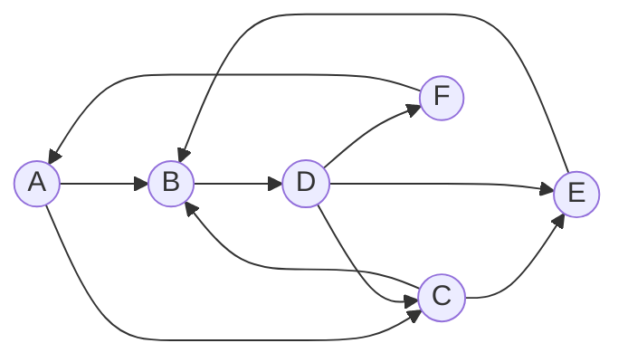
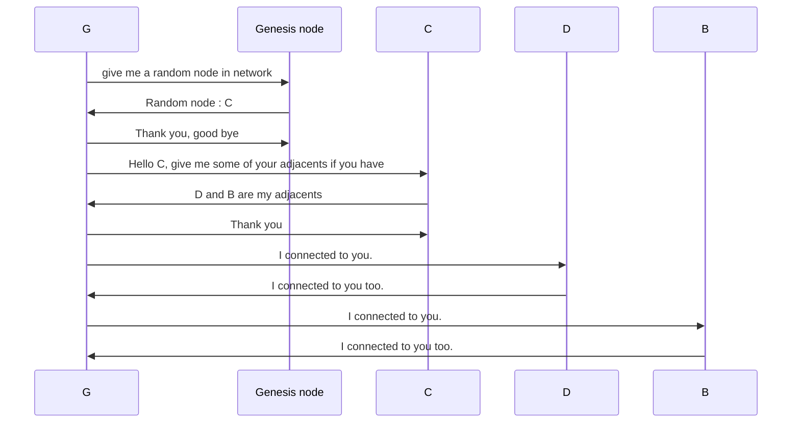
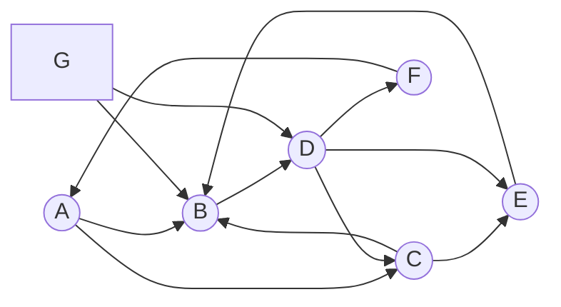

# Peer-to-Peer  Network Project 
<details open="open">
  <summary>Contents</summary>
  <ol>
    <li>
      <a href="#the-project">The Project</a>
      <ul>
        <li><a href="#what-is-peer-to-peer-network">What is Peer-to-peer Network</a></li>
		<li><a href="#about-the-project">About the project</a></li>
		<li><a href="#file-structure">File structure</a></li>
		<li><a href="#code">Explanation of source code</a></li>
   </ul>
   </li>

   <li><a href="#usage">Usage</a></li>
   
   <li><a href="#roadmap">Roadmap</a></li>
   <li><a href="#contact">Contact</a></li>

  </ol>
</details>


# THE PROJECT


### What is Peer-to-Peer Network

P2P network is a distruted network architecture that doesn't need a server for comminication. In p2p network, each computer that joined the network called Peer (or Node) and they are connected to each other directly. Mainly this network is used in file sharing and blockchain applications.


### About the project

This project is coded for creating peer-to-peer network  and you can modify and use it in your projects. 

A point of departure in this project is that I tried to create my own blockchain application, but I needed a peer-to-peer network , but I couldn't find a well-rounded example of p2p network. As a result of this, I created this p2p network project to use in my blockchain based application . 


### How does it work

The network based on **TCP/IP** connections. To create the network, there should be at least one peer that every other peers know its IP address and port. In this project this Peer (or peers) will be called as **GENESIS NODE**. 

As I mentioned, **everyone know genesis node's IP address and port.** Otherwise, *if a peer wants to join the network, it couldn't know which ip addresses to connect.*

<br/>
<br/>
If a device wants to join the p2p network, following will be take place: 

- Candicate node (the device who wants to join the network)  will connect to **Genesis node** firstly,
- This node  ask for address and port of a random peer in the network from genesis node, 
- If there exist one or more node in network (except for genesis node), the genesis node will send this existing ip address to the candicate device in json structure. Otherwise, candicate node will connect to genesis node
-  The following step is that this new peer will ask for the list of nodes in network. 
- After these steps, the node joined the network. Now, this new node will broadcast that it joined the network.  All of other nodes that recieve this broadcast message will add this node's ip address and ports in to the list named as ***nodes_in_network***. In this way, all nodes know each other's address.

  
<br/>


This is what happens when a device  wants to join the network.

<br/>
<br/>
<br/>


### File structure
```bash

│   commands.py
│   Message.py
│   Network.py
│   Node.py
│   node1.py
│   node2.py
│
│
├───helpers
│   │   cmd_helper.py
│   │   terminal_helper.py
│   │   __init__.py
│
│
├───settings
│   │   includes.py
│   │   terminal_set.py
│   │   __init__.py
│
```
<br>
<br>

## Usage


In **Node .py** file , there a **Node class** , which includes all attritibues and methods  of a Node. 

Network.py consists of a **Network class** which inherited from  Node class. So, a connection is established by using an instance of this class. 

In Node class, there are GENESIS_NODE_ADDR and GENESIS_NODE_PORT variables which is the genesis node's connection address known by everyone.


To starting genesis node,
```python
from Network import Network

peer = Network("localhost") #Node instance is created
peer.start(5050)

#Genesis node is created and started 


data=input()

while(data != '!DISCONNECT'):
	peer.broadcast(data)
	data=input()

```
for example, If you want to create an another peer except for Genesis node, you should apply the same process for different ip address and port. (If you run this p2p network on your local network, each pear must start with on different port.)

```python
from Network import Network

peer = Network("localhost") #Node instance is created
peer.start(5051)

#A peer started


data=input()

while(data != '!DISCONNECT'):
	peer.broadcast(data)
	data=input()

```
**broadcast method**, sends a broadcast json formatted message to all other peers in the network . It is guarantied that all peers recieve the broadcast message. This message includes message id, title, message , and timestamp. 

Here is an example of the message.
```
{
'id': 'fbc019f3a87787f904b54875f62e2193445f0e0f4e82f6978d77dbe29d7a9894',
'title': '#BROADCAST',
'message': 'Hello world',
'time': 1617555967.1199386
}

```
# More
This peer to peer network is unstructed. It means that network is created randomly. Each node has more than 2 peers. For example assume that there are 6 peers in the network. If you draw nodes and connections, it will be a network like that





As you see, it is very complicated structure, and it is very hard to guess the structure since connections established randomly. 

To understand clearly , assume that a new node **G** want to join this network. The schematic presentation of this process will be like that. 


**After this process, the next presentation of graph will be like this  :**



As you see, G is joined the network...


